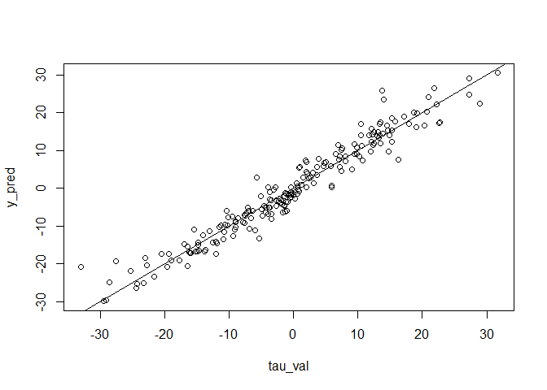

<!-- README.md is generated from README.Rmd. Please edit that file -->

# RCATE

<!-- badges: start -->

<!-- badges: end -->

Causal Inference using GBM, Random Forests, Neural Network, and B-spline
Additive Model

An R package producing robust estimation of treatment effects by fitting
a collection of treatment and response models using the machine learning
algorithms and regression model.

The main way to install the package is by using CRAN’s distribution. It
can be installed from within R using typical install.packages()
mechanism.

## Installation

You can install the released version of RCATE from
[CRAN](https://CRAN.R-project.org) with:

``` r
install.packages("RCATE")
```

And the development version from [GitHub](https://github.com/) with:

``` r
# install.packages("devtools")
devtools::install_github("rhli-Hannah/RCATE")
```

## Example

This is a basic example which shows you how to solve a common problem:

``` r
library(RCATE)

## basic example
n <- 1000; p <- 10
X <- matrix(rnorm(n*p,0,1),nrow=n,ncol=p)
tau = 6*sin(2*X[,1])+3*(X[,2]+3)*X[,3]+9*tanh(0.5*X[,4])+3*X[,5]*(2*I(X[,4]<1)-1)
p = 1/(1+exp(-X[,1]+X[,2]))
d = rbinom(n,1,p)
t = 2*d-1
y = 100+4*X[,1]+X[,2]-3*X[,3]+tau*t/2 + rnorm(n,0,1)
x_val = matrix(rnorm(200*10,0,1),nrow=200,ncol=10)
tau_val = 6*sin(2*x_val[,1])+3*(x_val[,2]+3)*x_val[,3]+9*tanh(0.5*x_val[,4])+
3*x_val[,5]*(2*I(x_val[,4]<1)-1)
# Use L1 R-learning and GBM to estimate CATE
fit <- rcate.ml(X,y,d,method='RL')
y_pred <- predict(fit,x_val)$predict
plot(tau_val,y_pred);abline(0,1)
```


